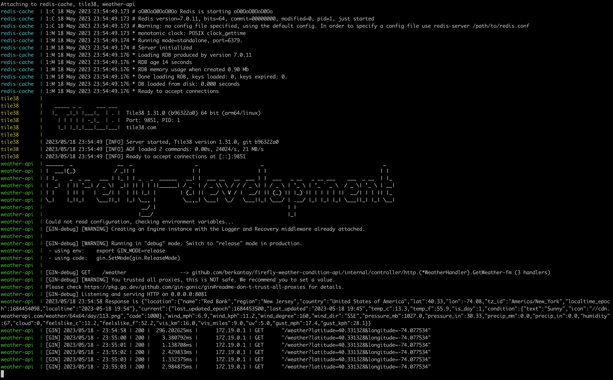

# firefly-weather-condition-api

This weather condition api collects and returns the weather conditions at a given Market.

## To-Do

- [x] Write a service that returns weather conditions at a given Market.
  - [x] The service should take latitude and longitude as input.
  - [x] The service should check if the given Point(lat, long) is in the given Market, e.g. New York.
  - [x] Tile38 - Ultra Fast Geospatial Database & Geofencing Server should be used for this check.
  - [x] You should populate new_york.geojson to Tile38 at setup.
  - [x] If the given Point is not in the Market, return a proper response such as "The Point is not in the market area".
  - [x] If the Point is in the market, first check the cache, use: Redis - in-memory data structure store, then call a free Weather API service, then cache and return the response.
  - [x] You should use Uber's H3 resolution 8 index as the cache key and set TTL for the key such as 60 seconds. You can find the H3 hierarchical geospatial indexing system details at https://h3geo.org/.
  - [x] You can use a free weather service like https://rapidapi.com/weatherapi/api/weatherapi-com or any other one that you prefer.
- [x] The service should be written using The GO Programming Language.
- [x] The service should be dockerized.
- [x] Unit and Integration Tests should be written. Test coverage of more than 85% is expected.
- [x] The Clean Architecture is preferred, but you can use any one that you prefer.
- [x] You should share the project on the Github repo with AliCaner and Mecit.
- [x] Demonstrating progressive development (e.g. not just a commit) and proper GitHub usage is a plus.

## Proposal Architecture


## Testing

```
make unit-test
```

```
make integration-test
```

Then total coverage is %86.4. Also cover.html is generated to check the covered and uncovered lines.

## Usage

```
docker-compose build --no-cache
docker-compose up
```

`docker-compose up -d` if daemon mode desired.
Then application will be running at **localhost:8081**

# Important

To inject polygon into _Tile38_

```
make geofence-migrate-newyork-local
```

## Terminal Output



K6 Load Test Result


## API Documentation

API Documentation implemented. Visit `http://localhost:8081/swagger/index.html`

### Get temperature on given coordinate

#### Request

`POST /weather/`

`curl "http://localhost:8081/weather?latitude=40.731328&longitude=-74.067534"`

### Response - Success

```
{
  "location": {
    "name": "Jersey City",
    "region": "New Jersey",
    "country": "United States of America",
    "lat": 40.73,
    "lon": -74.07,
    "tz_id": "America/New_York",
    "localtime_epoch": 1684305567,
    "localtime": "2023-05-17 2:39"
  },
  "current": {
    "last_updated_epoch": 1684305000,
    "last_updated": "2023-05-17 02:30",
    "temp_c": 20.6,
    "temp_f": 69.1,
    "is_day": 0,
    "condition": {
      "text": "Clear",
      "icon": "//cdn.weatherapi.com/weather/64x64/night/113.png",
      "code": 1000
    },
    "wind_mph": 2.2,
    "wind_kph": 3.6,
    "wind_degree": 327,
    "wind_dir": "NNW",
    "pressure_mb": 1001,
    "pressure_in": 29.56,
    "precip_mm": 0,
    "precip_in": 0,
    "humidity": 39,
    "cloud": 0,
    "feelslike_c": 20.6,
    "feelslike_f": 69.1,
    "vis_km": 16,
    "vis_miles": 9,
    "uv": 1,
    "gust_mph": 17,
    "gust_kph": 27.4
  }
}
```

### Response - Point not in the market area

```
{
    "error": "the point is not in the market area"
}
```
